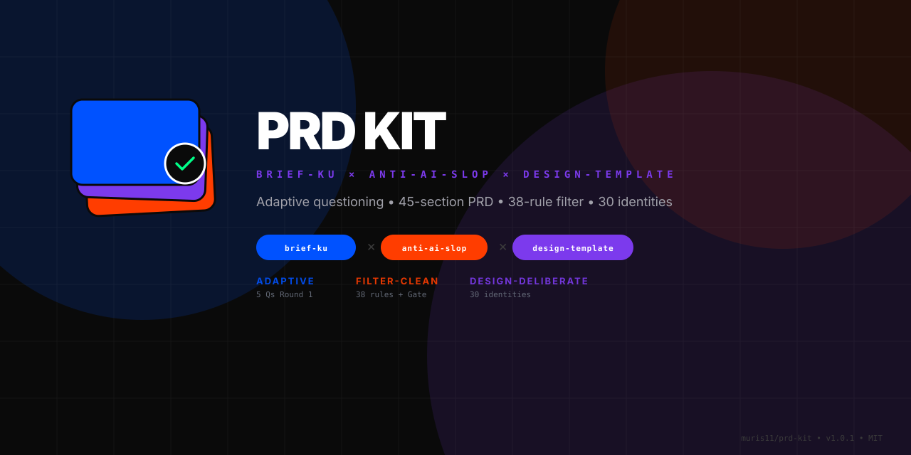
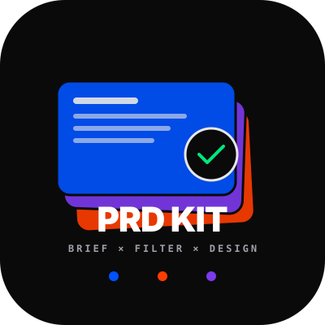
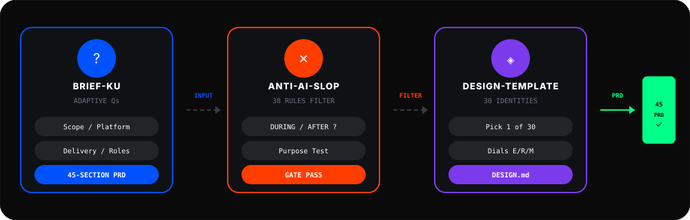
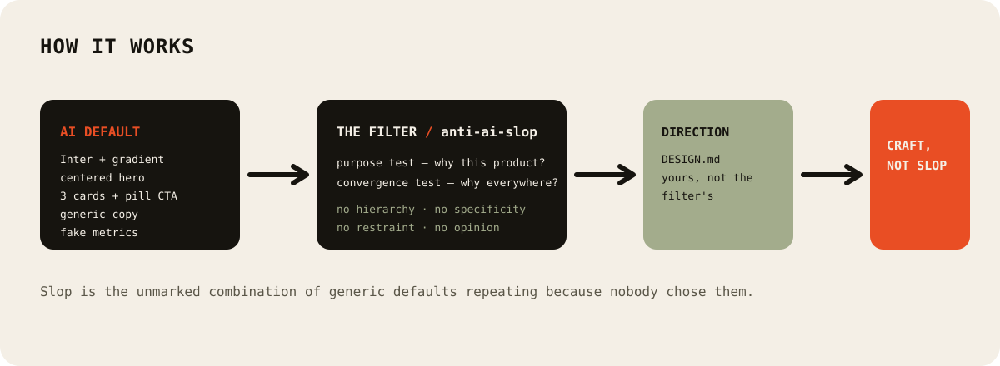
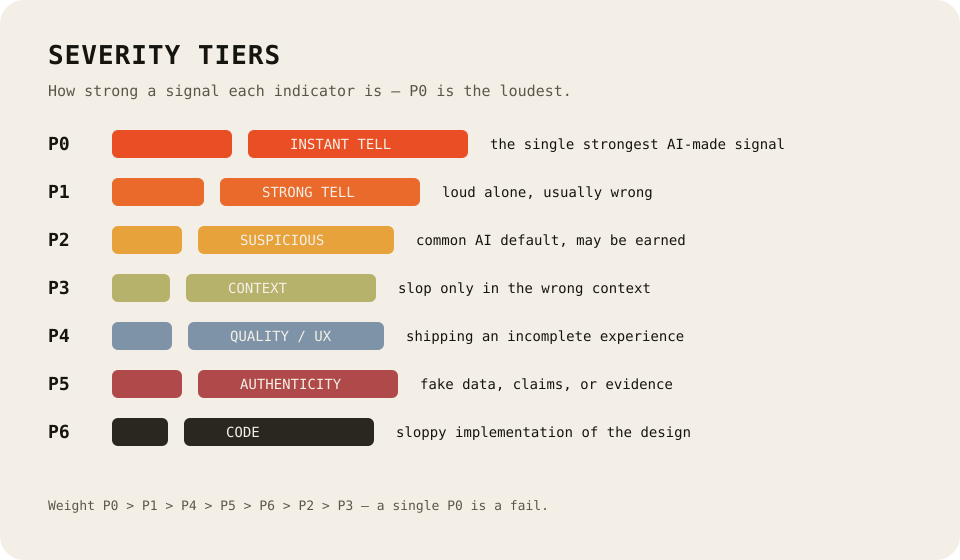

<p align="center">
  
</p>

<p align="center">
  
  <br/>
  <sub>Logo baru: tumpukan PRD — brief-ku (biru) × anti-ai-slop (merah) × design-template (violet) → ✓ 45-section PRD</sub>
</p>

<h1 align="center">prd-kit — Maximal PRD Builder</h1>

<p align="center">
  <strong>brief-ku × anti-ai-slop × design-template</strong><br/>
  Satu skill untuk mengubah <em>ide samar</em> jadi <em>PRD siap-build</em> yang filter-bersih, desain-deliberate, dan traceable.<br/>
  Tanya adaptif • PRD 45-section • Filter 38-rule slop • 30 identitas desain • TDD + Verifikasi Route
</p>

<p align="center">
  <a href="https://github.com/muris11/prd-kit"></a>
  <a href="https://www.npmjs.com/package/@muris11/prd-kit"></a>
  <a href="https://www.skills.sh/muris11/prd-kit"></a>
  
  
  
</p>

<p align="center">
  <a href="./README.md">🇬🇧 English</a> · <a href="#kenapa-hybrid">Kenapa Hybrid</a> · <a href="#katalog-skill">Katalog</a> · <a href="#alur-pertanyaan">Alur Tanya</a> · <a href="#instalasi">Instalasi</a> · <a href="#cara-uninstall">Uninstall</a>
</p>

<p align="center">
  
</p>

<p align="center">
  
  
</p>

---

## Kenapa Hybrid? (Masuk di Pertanyaannya!)

| Sendirian | Masalah |
|---|---|
| `brief-ku` saja | PRD lengkap tapi rawan **slop generik** — gradient biru-ungu default, bento grid, buzzwords, fake stats. |
| `anti-ai-slop` saja | Filter tanpa arah — jadi **sterile void** (putih abu-abu tipis, no identity). |
| `design-template` saja | Cantik tanpa **kebutuhan bisnis** — data model, auth, route traceability hilang. |

**Hybrid = pertanyaan di Round 1-2 langsung tanya 5 hal sekaligus:**

```text
1. Scope: Tampilan saja / Full functional / Belum tahu
2. Platform: Web / Mobile / Belum tahu
3. Delivery: Prototype / MVP / Production-ready
4. Anti-slop mode: DURING (filter saat nulis) / AFTER (audit numbered findings)
5. Design identity: 30 template (monochrome, bauhaus, cyberpunk...) atau Belum tahu → recommend
```

→ PRD keluar sudah **anti-slop, berkarakter, dan siap di-code**.

---

## Apa yang Dihasilkan PRD Kit

**Satu prompt samar:**

> "Buatkan saya aplikasi absensi."

**Keluar 45-section PRD siap-build:**

```
1. Project Overview  2. Problem Statement  3. Goals  4. Target Users  5. Scope
6. In Scope  7. Out of Scope  8. Future  9. Platform  10. Delivery Level
11. Roles & Permissions  12. Functional Requirements  13. Feature Priority (P0/P1/P2)
14. Traceability (REQ- → Pages/APIs/Data/Tests)  15. User Flows  16. Pages & Navigation
17. Route Inventory  18. Route Access Matrix  19. Route Exceptions  20. UI Requirements (+ DESIGN.md + dials)
21. Technology Stack  22. System Architecture  23. Database Design  24. Data Lifecycle & Ops
25. API Specification  26. Authentication  27. Authorization  28. Security Requirements (+ anti-slop gate)
29. Validation Rules  30. Error Handling  31. Edge Cases  32. Non-Functional  33. Testing Requirements
34. TDD Strategy & Test Seams  35. TDD Vertical Slices  36. Route Verification Matrix  37. Verification Matrix
38. Test Commands  39. Environment Variables  40. Deployment  41. Development Phases  42. Implementation Tasks (TDD)
43. Acceptance Criteria  44. Definition of Done  45. Assumptions
+ Anti-slop Delivery Gate (4 blocks) + Design Checklist (template-specific)
```

Tiap P0 punya: Pages, APIs, Data, Business Rules, Verification — traceable. Tiap route punya 10-layer verification.

---

## Katalog Skill — 3 Hybrid Skills

| Skill | Kapan Load | Apa yang Ditambah ke Pertanyaan |
|---|---|---|
| `prd` | **MAIN** — Selalu load. Ubah ide samar → PRD 45-section via tanya adaptif. | Round 1: 5 pertanyaan fondasi (scope/platform/delivery + slop mode + design). Round 2: users/roles/workflow + dials desain. Round 3+: kondisional (payments/GPS/files/integrasi). Full PRD + TDD slices. |
| `prd-anti-slop` | Load bareng `prd` kalau PRD ada klaim, angka, testimoni, nav, visual. | Round 1: "DURING atau AFTER?"  Round 2: "DESIGN.md? 1) user tulis 2) agent draft warning 3) skip → draft ENERGY1/RHYTHM1/MOTION1". Gate check sebelum ship. |
| `prd-design` | Load bareng `prd` kalau UI Requirements penting. | Round 1/2: Picker 30 template (monochrome→retro) + "Belum tahu → recommend". Inject DESIGN.md + dials ENERGY/RHYTHM/MOTION ke PRD Section 20. |

**Loader:**
```
Skill: prd              # maximal hybrid alone (recommended)
Skill: prd + prd-anti-slop + prd-design  # full explicit (sama aja, lebih verbose)
```

> **2 utilities + 30 templates** tetap ada via `design-template` dependency. PRD Kit tidak duplikat — ia *manggil* mereka lewat pertanyaan.

---

## Alur Pertanyaan — Adaptive Multi-Round (Masuk di Pertanyaannya)

**Principle:** Jangan tanya 20 sekaligus. Tanya set terkecil yang unlock keputusan berikutnya. Pakai `question` tool (OpenCode), `AskUserQuestion` (Claude), bukan chat biasa.

### Round 1 — Foundation (2-3 menit, 5 questions max)

**Via `question` tool (single selection each):**

1. **Scope:** `Tampilan saja` / `Full functional` / `Belum tahu` (default Full)
2. **Platform:** `Web-based` / `Mobile app` / `Belum tahu` (default Web)
3. **Delivery:** `Prototype` / `MVP` / `Production-ready` — tanya hanya jika materially changes scope
4. **[anti-slop]** **Slop mode:** `DURING` (filter saat nulis) / `AFTER` (audit numbered findings) — *dari prd-anti-slop*
5. **[design]** **Design direction:** List 30 template (monochrome...retro) + `Belum tahu → recommend` — *dari prd-design*

> **Rule:** Jangan tanya backend/auth/roles di Round 1 — relevance tergantung jawaban Round 1.

### Planning Checkpoint (1-3 kalimat, bukan PRD)

> *Arah awal: web full functional MVP, DURING filter, design Bauhaus. Artinya butuh akun, data, aturan akses, plus palette primaries + hard shadows. Berikutnya perlu perjelas pengguna & alur inti.*

### Round 2 — Product Shape (2-5 questions, adaptive)

*   Jika **Full functional:** tanya users/roles, workflow P0, login behavior, data persist, business rules. + **[design]** tanya dials: `Reading this as: <app kind> for <audience>, in <template> style, dial E/R/M?`
*   Jika **UI/prototype:** tanya pages, interactions, mock data, visual direction, responsive targets — jangan tanya backend.

### Round 3+ — Conditional Detail (small rounds, only if needed)

*   Jika user sebut **GPS/pembayaran/file/integrasi/data sensitif/deployment** → tanya focused follow-up *hanya* untuk itu.
*   Tiap round diawali checkpoint: *"Tadi X, jadi Y perlu diperjelas..."*

**Stop:** 80-100% completeness → generate PRD + document minor assumptions. Jangan force 100% artifisial.

**"Tidak tahu" handling:** `bebas/terserah/tidak tahu/rekomendasikan` → pilih yang paling cocok & jelaskan kenapa (contoh: "PostgreSQL karena relasional").

---

## Instalasi — Super Lengkap

### 1 — npx skills (recommended)

```bash
npx skills add muris11/prd-kit --skill prd
# atau semua 3
npx skills add muris11/prd-kit

# via GitHub langsung
npx skills add https://github.com/muris11/prd-kit
```

### 2 — Claude Code Plugin

```bash
/plugin add muris11/prd-kit
```

Auto-discovers via `.claude-plugin/plugin.json` → `skills: ["./skills/"]`

### 3 — npm (publish sebagai @muris11/prd-kit@1.0.1)

```bash
npm install @muris11/prd-kit
# pnpm / yarn / bun
pnpm add @muris11/prd-kit
yarn add @muris11/prd-kit
bun add @muris11/prd-kit

# verify
npm view @muris11/prd-kit version  # → 1.0.1
ls node_modules/@muris11/prd-kit/skills | wc -l  # → 3
# direct
# https://www.npmjs.com/package/@muris11/prd-kit
# https://www.skills.sh/muris11/prd-kit
```

### 4 — Manual

```bash
git clone https://github.com/muris11/prd-kit.git
cp -r prd-kit/skills/prd ./skills/prd
```

### Dependencies (otomatis via npx skills)

*   `brief-ku` → `Adytm404/brief-ku`
*   `anti-ai-slop` → `muris11/anti-ai-slop`
*   `design-template` → `muris11/design-template` (30 identities, 1.0.29)

---

## Cara Uninstall — Lengkap

Hapus skill dari agent & project. Pilih sesuai cara install lu:

### Via skills CLI (recommended)

```bash
# hapus satu skill
npx skills remove prd
npx skills remove prd-anti-slop
npx skills remove prd-design

# hapus semua prd-kit
npx skills remove prd prd-anti-slop prd-design
# atau
skills remove prd-kit
skills remove prd
skills ls  # verify hilang
```

**Opsi scope:**
```bash
# hapus global saja
skills remove prd --global

# hapus project saja
skills remove prd --project

# hapus semua skills global
skills remove --all --global
```

### Via Claude Code Plugin

```bash
/plugin remove prd-kit
# atau
/plugin remove muris11/prd-kit
```

### Via npm

```bash
npm uninstall @muris11/prd-kit
# pnpm / yarn / bun
pnpm remove @muris11/prd-kit
yarn remove @muris11/prd-kit
bun remove @muris11/prd-kit
```

### Manual

```bash
# hapus folder skill
rm -rf skills/prd
rm -rf skills/prd-anti-slop
rm -rf skills/prd-design

# hapus repo clone
rm -rf prd-kit

# hapus cache skills.sh (optional)
rm -rf ~/.skills
```

### Verify Uninstall

```bash
skills ls          # harus tidak ada prd*
skills ls --global # cek global
ls skills/         # harus tidak ada folder prd*
npm ls @muris11/prd-kit  # harus empty
```

> **Note:** Uninstall tidak menghapus PRD yang sudah di-generate (file `PRD.md` tetap ada). Hapus manual jika mau.

---

## Penggunaan — One Prompt to PRD

```text
Buatkan saya aplikasi absensi dengan validasi GPS.
```

**Agent (PRD Kit) akan:**

1. Detect Plan vs Build mode (OpenCode/Claude/Cursor)
2. Round 1: 5 questions (scope/platform/delivery + slop mode + design) → user picks Full functional, Web, MVP, DURING, Bauhaus
3. Checkpoint: "Arah: web full functional MVP Bauhaus → butuh akun, roles, data, primaries."
4. Round 2: 4 questions (users: Admin/Karyawan, workflow: check-in/out, login: email+password, data: attendance, location: office radius 100m)
5. Generate 45-section PRD + anti-slop gate + Bauhaus checklist + TDD slices.

**Build mode:** langsung implementasi vertical slices (Red→Green per slice).
**Plan mode:** berhenti setelah PRD + tanya "mau switch ke Build?"

---

## Anti-ai-slop Integration

Purpose test + Convergence test tiap teknik harus lulus. Delivery Gate 4 blocks (Hard Gate all NO, Purpose-Gate FAIL if no reason, Liveliness all YES, Quality Locks all NO). Liveliness 3 Dials ENERGY/RHYTHM/MOTION.

<p align="center">
  
</p>

---

## Design-template Integration

30 template (monochrome→retro) dipilih via pertanyaan Round 1/2 → DESIGN.md + dials masuk PRD Section 20.

<p align="center">
  
</p>

---

## Kontribusi

```bash
git clone https://github.com/muris11/prd-kit.git
Copy-Item -Recurse skills/prd skills/prd-myvariant
# edit SKILL.md → name/description + hybrid logic
git add . && git commit -m "feat: myvariant" && git push
```

## Lisensi

MIT 2026 muris11 — see [LICENSE](./LICENSE)
