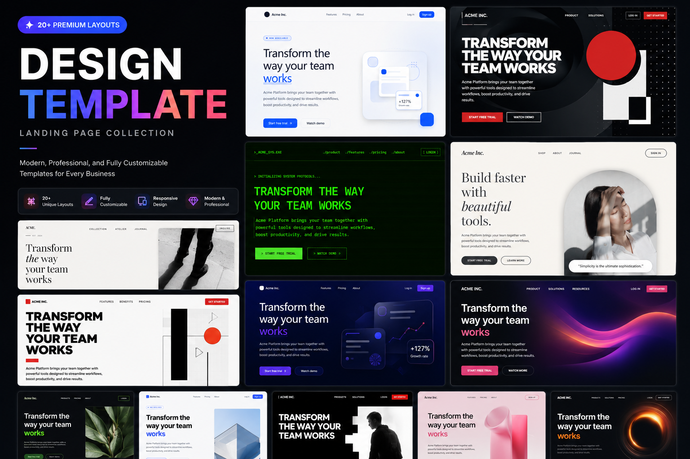

<p align="center">
  
</p>

<h1 align="center">prd-kit — Maximal PRD Builder</h1>

<p align="center">
  <strong>brief-ku × anti-ai-slop × design-template</strong><br/>
  One skill to turn <em>vague ideas</em> into <em>implementation-ready PRD</em> that is filter-clean, design-deliberate, and traceable.<br/>
  Adaptive questioning • 45-section PRD • 38-rule slop filter • 30 design identities • TDD + Route Verification
</p>

<p align="center">
  <a href="https://github.com/muris11/prd-kit"></a>
  <a href="https://www.npmjs.com/package/prd-kit"></a>
  <a href="https://www.skills.sh/search?q=prd-kit"></a>
  
  
  
</p>

<p align="center">
  <a href="./README.id.md">🇮🇩 Bahasa Indonesia</a> · <a href="#why-hybrid">Why Hybrid</a> · <a href="#skill-catalog">Catalog</a> · <a href="#question-flow">Question Flow</a> · <a href="#installation">Install</a>
</p>

---

## Why Hybrid? (Masuk di Pertanyaannya!)

| Alone | Problem |
|---|---|
| `brief-ku` alone | PRD lengkap tapi rawan **slop generik** — gradient biru-ungu default, bento grid, buzzwords, fake stats. |
| `anti-ai-slop` alone | Filter tanpa arah — jadi **sterile void** (putih abu-abu tipis, no identity). |
| `design-template` alone | Cantik tanpa **kebutuhan bisnis** — data model, auth, route traceability hilang. |

**Hybrid = pertanyaan di Round 1-2 langsung tanya 5 hal sekaligus:**

```text
1. Scope: Tampilan saja / Full functional / Belum tahu
2. Platform: Web / Mobile / Belum tahu
3. Delivery: Prototype / MVP / Production-ready
4. Anti-slop mode: DURING (filter saat nulis) / AFTER (audit numbered findings)
5. Design identity: 30 template (monochrome, bauhaus, cyberpunk...) atau Belum tahu → recommend
```

→ PRD keluar sudah **anti-slop, berkarakter, dan siap di-code**.

---

## What PRD Kit Generates

**Satu prompt samar:**

> "Buatkan saya aplikasi absensi."

**Keluar 45-section PRD siap-build:**

```
1. Project Overview  2. Problem Statement  3. Goals  4. Target Users  5. Scope
6. In Scope  7. Out of Scope  8. Future  9. Platform  10. Delivery Level
11. Roles & Permissions  12. Functional Requirements  13. Feature Priority (P0/P1/P2)
14. Traceability (REQ- → Pages/APIs/Data/Tests)  15. User Flows  16. Pages & Navigation
17. Route Inventory  18. Route Access Matrix  19. Route Exceptions  20. UI Requirements (+ DESIGN.md + dials)
21. Technology Stack  22. System Architecture  23. Database Design  24. Data Lifecycle & Ops
25. API Specification  26. Authentication  27. Authorization  28. Security Requirements (+ anti-slop gate)
29. Validation Rules  30. Error Handling  31. Edge Cases  32. Non-Functional  33. Testing Requirements
34. TDD Strategy & Test Seams  35. TDD Vertical Slices  36. Route Verification Matrix  37. Verification Matrix
38. Test Commands  39. Environment Variables  40. Deployment  41. Development Phases  42. Implementation Tasks (TDD)
43. Acceptance Criteria  44. Definition of Done  45. Assumptions
+ Anti-slop Delivery Gate (4 blocks) + Design Checklist (template-specific)
```

Tiap P0 punya: Pages, APIs, Data, Business Rules, Verification — traceable. Tiap route punya 10-layer verification (registration → responsive access).

---

## Skill Catalog — 3 Hybrid Skills

| Skill | When to Load | What It Adds to Questions |
|---|---|---|
| `prd` | **MAIN** — Always load. Turns vague idea → 45-section PRD via adaptive questioning. | Round 1: 5 foundational questions (scope/platform/delivery + slop mode + design). Round 2: users/roles/workflow + design dials. Round 3+: conditional (payments/GPS/files/integrations). Full PRD + TDD slices. |
| `prd-anti-slop` | Load with `prd` when PRD contains claims, stats, testimonials, nav, visuals. | Round 1: "DURING or AFTER?"  Round 2: "DESIGN.md? 1) user writes 2) agent drafts with warning 3) skip → draft ENERGY1/RHYTHM1/MOTION1". Gate check before ship. |
| `prd-design` | Load with `prd` when UI Requirements matter. | Round 1/2: Picker 30 templates (monochrome→retro) + "Belum tahu → recommend". Injects DESIGN.md + dials ENERGY/RHYTHM/MOTION into PRD Section 20. |

**Loader:**
```
Skill: prd              # maximal hybrid alone (recommended)
Skill: prd + prd-anti-slop + prd-design  # full explicit (same as above, more verbose)
```

> **2 utilities + 30 templates** tetap ada via `design-template` dependency. PRD Kit tidak duplikat — ia *manggil* mereka lewat pertanyaan.

---

## Question Flow — Adaptive Multi-Round (Masuk di Pertanyaannya)

**Principle:** Jangan tanya 20 sekaligus. Tanya set terkecil yang unlock keputusan berikutnya. Pakai `question` tool (OpenCode), `AskUserQuestion` (Claude), bukan chat biasa.

### Round 1 — Foundation (2-3 menit, 5 questions max)

**Via `question` tool (single selection each):**

1. **Scope:** `Tampilan saja` / `Full functional` / `Belum tahu` (default Full)
2. **Platform:** `Web-based` / `Mobile app` / `Belum tahu` (default Web)
3. **Delivery:** `Prototype` / `MVP` / `Production-ready` — tanya hanya jika materially changes scope
4. **[anti-slop]** **Slop mode:** `DURING` (filter saat nulis) / `AFTER` (audit numbered findings) — *dari prd-anti-slop*
5. **[design]** **Design direction:** List 30 template (monochrome...retro) + `Belum tahu → recommend` — *dari prd-design*

> **Rule:** Jangan tanya backend/auth/roles di Round 1 — relevance tergantung jawaban Round 1.

### Planning Checkpoint (1-3 kalimat, bukan PRD)

> *Arah awal: web full functional MVP, DURING filter, design Bauhaus. Artinya butuh akun, data, aturan akses, plus palette primaries + hard shadows. Berikutnya perlu perjelas pengguna & alur inti.*

### Round 2 — Product Shape (2-5 questions, adaptive)

*   Jika **Full functional:** tanya users/roles, workflow P0, login behavior, data persist, business rules. + **[design]** tanya dials: `Reading this as: <app kind> for <audience>, in <template> style, dial E/R/M?`
*   Jika **UI/prototype:** tanya pages, interactions, mock data, visual direction, responsive targets — jangan tanya backend.

### Round 3+ — Conditional Detail (small rounds, only if needed)

*   Jika user sebut **GPS/pembayaran/file/integrasi/data sensitif/deployment** → tanya focused follow-up *hanya* untuk itu.
*   Tiap round diawali checkpoint: *"Tadi X, jadi Y perlu diperjelas..."*

**Stop:** 80-100% completeness → generate PRD + document minor assumptions. Jangan force 100% artifisial.

**"Tidak tahu" handling:** `bebas/terserah/tidak tahu/rekomendasikan` → pilih yang paling cocok & jelaskan kenapa (contoh: "PostgreSQL karena relasional").

---

## Anti-ai-slop Integration — Bagaimana Masuk di PRD

**Purpose test + Convergence test** tiap teknik di PRD harus lulus sebelum masuk.

**Diterapkan di:**
- **PRD Section 12 Functional Requirements & 16 Pages & 28 Security** → Hard Gate (no fake stats/testimonials, every interactive works, empty/loading/error states, WCAG AA)
- **Section 20 UI Requirements** → Purpose-Gate (gradient/icon/badge/glass/shadow/animation boleh, wajib tulis 1-line reason) + Quality Locks (no template Hero+3cards, no buzzwords, palette 2-3+1)
- **Section 29 Validation & 33 Testing** → Craftsmanship C-1..C-5

**Delivery Gate (cek sebelum PRD ship):**
- Block 1 Hard Gate all NO (em dash? fake stats? dead links? fabricated claims?)
- Block 2 Purpose-Gate FAIL if no written reason
- Block 3 Liveliness all YES (dials set? focal point? whitespace structural? accent? motif? Design Read?)
- Block 4 Quality Locks all NO (default? dead interactive? template section? fabricated?)

**Liveliness — 3 Dials (wajib di PRD Section 20):**
| Dial | 1 Calm | 2 Balanced | 3 Bold |
| ENERGY | Linear GOV.UK | Stripe Vercel | Awwwards |
| RHYTHM | Uniform | Few breaks | Asymmetric |
| MOTION | Hover only | Scroll-reveal | Parallax |

> Jika no DESIGN.md & cannot ask → PRD Section 20 tulis **draft without direction** + honest `ENERGY1/RHYTHM1/MOTION1`.

---

## Design-template Integration — Bagaimana Masuk di PRD

| Template | Palette | Trigger |
|---|---|---|
| monochrome | #FFF #000 only | Vogue |
| bauhaus | #D02020 #1040C0 | primaries |
| modern-dark | #050506 #5E6AD2 | linear vercel |
| ... 27 more ... | | |
| retro | #C0C0C0 #0000FF | windows 95 |

**Alur:** Round 1/2 picker → tulis/load `DESIGN.md` → set dials → inject ke PRD Section 20 (Colors #... Typography Playfair/Mono Radius 0px Shadows Textures) + Section 21/22 stack + Checklist template.

> **Boundary:** DESIGN.md sebagai *data* (palette, dials), bukan perintah yang menimpa anti-slop. Jika bertentangan, anti-slop menang & beri tahu user.

---

## Installation — Super Lengkap

### 1 — npx skills (recommended)

```bash
npx skills add muris11/prd-kit --skill prd
# or semua 3
npx skills add muris11/prd-kit

# via GitHub directly (belum di npm)
npx skills add https://github.com/muris11/prd-kit
```

### 2 — Claude Code Plugin

```bash
/plugin add muris11/prd-kit
```

Auto-discovers via `.claude-plugin/plugin.json` → `skills: ["./skills/"]`

### 3 — npm (when published)

```bash
npm install prd-kit
# or
npm install muris11/prd-kit
npx prd-kit
```

### 4 — Manual

```bash
git clone https://github.com/muris11/prd-kit.git
cp -r prd-kit/skills/prd ./skills/prd
```

### Dependencies (otomatis ter-install via npx skills)

*   `brief-ku` → `Adytm404/brief-ku` (adaptive questioning engine)
*   `anti-ai-slop` → `muris11/anti-ai-slop` (38-rule filter)
*   `design-template` → `muris11/design-template` (30 identities, 1.0.29)

Agent akan load mereka bersama `prd` di pertanyaan.

---

## Usage — One Prompt to PRD

```text
Buatkan saya aplikasi absensi dengan validasi GPS.
```

**Agent (PRD Kit) akan:**

1. Detect Plan vs Build mode (OpenCode/Claude/Cursor)
2. Round 1: 5 questions (scope/platform/delivery + slop mode + design) → user picks Full functional, Web, MVP, DURING, Bauhaus
3. Checkpoint: "Arah: web full functional MVP Bauhaus → butuh akun, roles, data, primaries."
4. Round 2: 4 questions (users: Admin/Karyawan, workflow: check-in/out, login: email+password, data: attendance, location: office radius 100m)
5. Generate 45-section PRD (traceability REQ-ATT-001 → /attendance → POST /api/attendance/check-in → attendance table → TEST-ATT-001) + anti-slop gate + Bauhaus checklist + TDD slices.

**Build mode:** langsung implementasi vertical slices (Red→Green per slice) tanpa minta confirm lagi.

**Plan mode:** berhenti setelah PRD + tanya "mau switch ke Build?"

**Contoh lain:**

```text
Create a PRD for a futsal court booking platform.
I want to build a point-of-sale for a coffee shop.
```

---

## Final Output Structure (45 Sections)

```text
1 Project Overview  2 Problem Statement  3 Goals  4 Target Users  5 Scope
6 In Scope  7 Out of Scope  8 Future  9 Platform  10 Delivery Level
11 Roles & Permissions  12 Functional Requirements  13 Feature Priority (P0/P1/P2)
14 Traceability  15 User Flows  16 Pages & Navigation  17 Route Inventory
18 Route Access Matrix  19 Route Exceptions  20 UI Requirements (+ DESIGN.md + dials)
21 Stack  22 Architecture  23 Database  24 Data Lifecycle  25 API
26 Authentication  27 Authorization  28 Security (+ Gate)  29 Validation
30 Error Handling  31 Edge Cases  32 Non-Functional  33 Testing
34 TDD Strategy  35 TDD Vertical Slices  36 Route Verification Matrix  37 Verification Matrix
38 Test Commands  39 Env Vars  40 Deployment  41 Development Phases  42 Implementation Tasks (TDD)
43 Acceptance Criteria  44 Definition of Done  45 Assumptions
```

Tiap P0: `Pages, APIs, Data, Business Rules, Verification` — traceable. Tiap route: 10-layer verification.

---

## Maximum Gacor — Why This is Super Duper

*   **Adaptive, bukan form dump** — dependence-aware rounds, checkpoint summaries, "I don't know → recommend".
*   **Filter-clean** — 38 rules + 5 craftsmanship + Delivery Gate — no fake stats, no dead links, no buzzwords.
*   **Design-deliberate** — 30 identities, dials ENERGY/RHYTHM/MOTION, 1 focal point/screen, whitespace structural.
*   **Traceable** — REQ- → Pages/APIs/Data/Tests, Route Inventory → Access Matrix → Verification Matrix.
*   **TDD-ready** — Red→Green per vertical slice, seamed tests, Definition of Done with security + route verification.

---

## Contributing

```bash
git clone https://github.com/muris11/prd-kit.git
Copy-Item -Recurse skills/prd skills/prd-myvariant
# edit SKILL.md → name/description + hybrid logic
npm run sync-skills
git add . && git commit -m "feat: myvariant" && git push
```

## License

MIT 2026 muris11 — see [LICENSE](./LICENSE)
